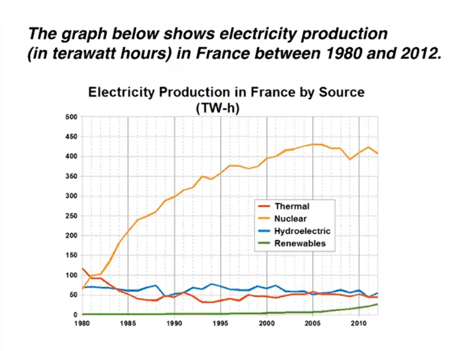
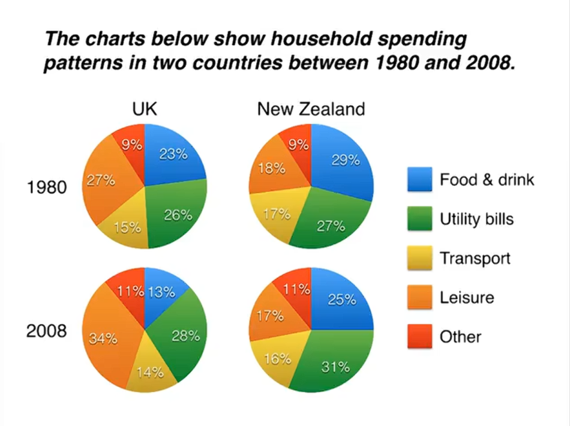
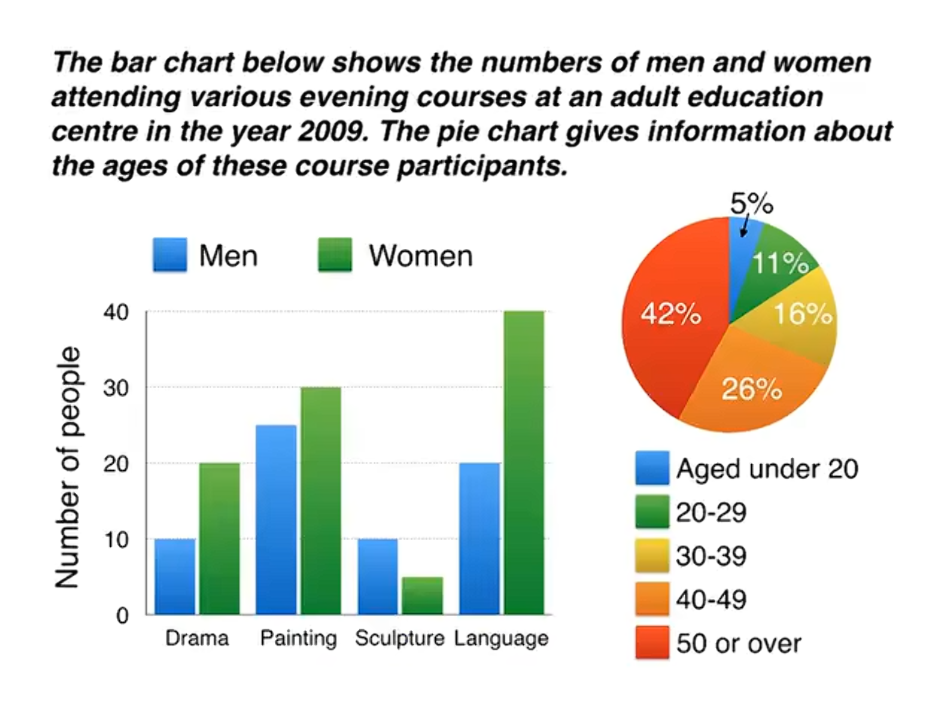
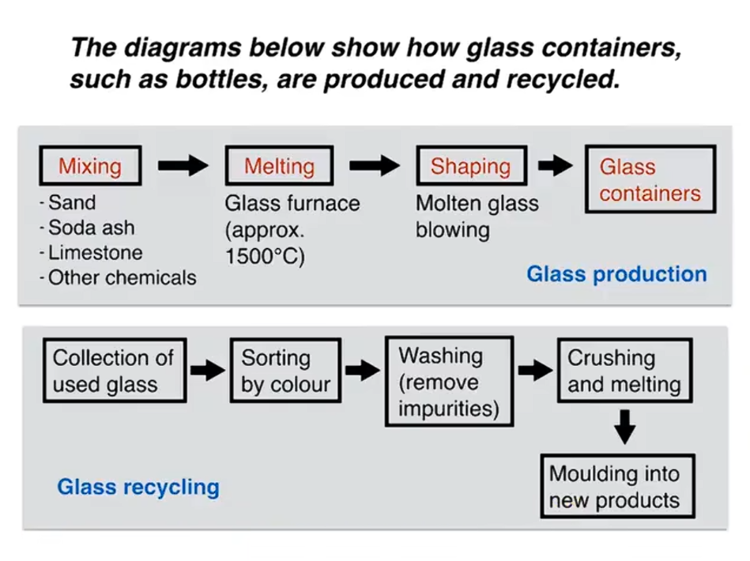
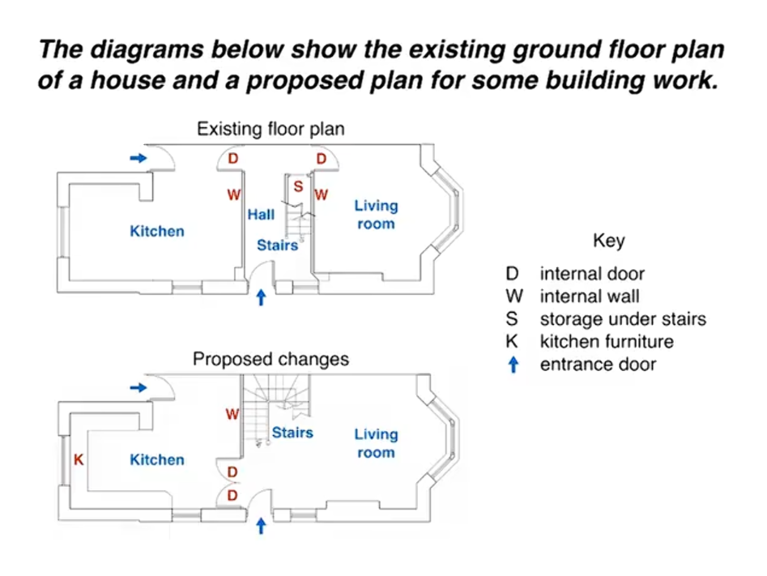
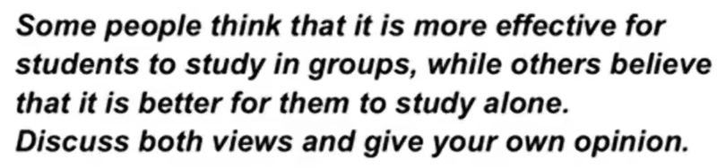
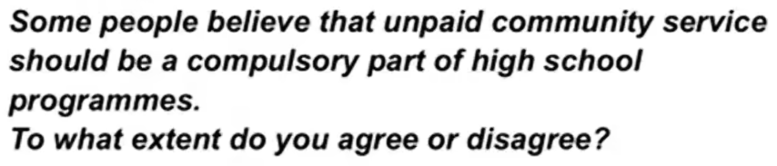
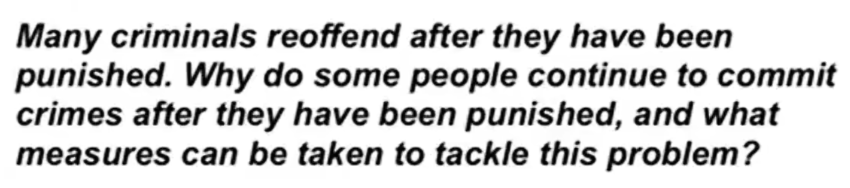
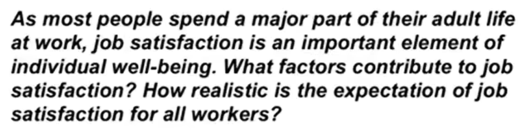
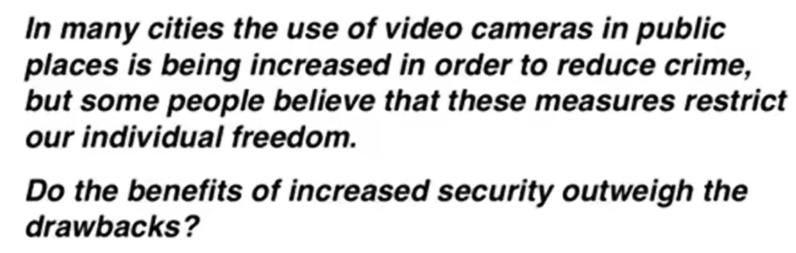

Question types

1. Line graph
2. Bar chart
3. Pie chart
4. Table
5. Diagram - comparing
6. Diagram - process

---

4 paragraphs

1. Introduction
2. Overview
3. Details
4. Details

# 1 Line graph

First, make a very general comparison

(summary / overview paragraph)

Second, compare the lines at specific points

('details' paragraphs)

---

Introduction - paraphrase the question

Overview - 2 sentences, 2 main points

Details - 2 paragraphs, compare the lines

---

Vocabulary: paraphrasing,

comparing, describing changes

- amount of electricity produced
- source of / provided / generating
- means of electricity generation
- over a period of / over the period shown
- by far the most important
- a negligible amount
- nuclear power overtook thermal power
- as the primary source of electricity
- rose dramatically to a peak of
- by contrast
- the figure for
- remained at this level, remained stable
- saw only a small rise

The line graph compares the amount of electricity produced in France using four different sources of power over a period of 32 years.

It is clear that nuclear power was by far the most important means of electricity generation over the period shown. Renewables provided the lowest amount of electricity in each year.

In 1980, thermal power stations were the main source of electricity in France, generating around 120 terawatt hours of power. Nuclear and hydroelectric power stations produced just under 75 terawatt hours of electricity each, and renewables provided a negligible amount. Just one year later. nuclear power overtook thermal power as the primary source of electricity.

Between 1980 and 2005, electricity production from nuclear power rose dramatically to a peak of 430 terawatt hours. By contrast, the figure for thermal power fell to only 50 terawatt hours in 1985, and remained at this level for the rest of the period. Hydroelectric power generation remained relatively stable, at between 50 and 80 terawatt hours, for the whole 32-year period, but renewable electricity production saw only a small rise to approximately 25 terawatt hours by 2012.

# 2 Bar charts

Vocabulary: paraphrasing,

comparing, describing changes

- sold worldwide
- sales figures, purchases
- most popular, best selling brand, top selling
- second most successful manufacturer
- market leader
- mobiles phones, handsets, units
- brands, manufacturers, companies, vendors
- saw the biggest rises, saw declining sales
- close to, almost, approximately, around
- double the number
- rise by a similar amount
- respectively
- overtook other to vendors

The bar chart compares the number of mobile phones sold worldwide by the five most popular manufacturers in the years 2009, 2011 and 2013. 

It is clear that Nokia sold the most mobile phones between 2009 and 2011, but Samsung became the best selling brand in 2013. Samsung and Apple saw the biggest rises in sales over the 5-year period.

In 2009, Nokia sold close to 450 million mobile phones, which was almost double the number of handsets sold by the second most successful manufacturer, Samsung. Over the following four years, however, Nokia's sales figures fell by approximately 200 million units, whereas Samsung saw sales rise by a similar amount. By 2013, Samsung had become the market leader with sales reaching 450 million units.

The other three top selling mobile phone brands between 2009 and 2013 were LG, ZTE and Apple. In 2009, these companies sold around 125 million, 50 million and 25 million mobile handsets respectively, but Apple overtook the other two vendors in 2011. In 2013, purchases of Apple handsets reached 150 million units, while LG saw declining sales and the figures for ZTE rose only slightly.

# 3 Pie charts

Vocabulary: paraphrasing,

comparing, describing changes

- spending, expenditure, spent, costs
- proportion of spending
- percentage of household budget
- the equivalent figure for a UK home
- fell, rose, saw an increase in
- by 2008, expenditure had fallen
- spent a significantly larger percentage
- than their New Zealand counterparts
- 29% of an average household budget went on
- while, by contrast
- leisure accounted for the highest proportion
- spent half as much in relative terms

The pie charts compare five categories of household expenditure in the UK and New Zealand in the years 1980 and 2008.

It is noticeable that the proportion of spending on food and drink fell in both countries over the 28-year period, while spending on utility bills rose. Also, UK residents spend a significantly larger percentage of their household budgets on leisure than their New Zealand counterparts.

In 1980, 29% of an average New Zealand household budge went on food and drink, while the equivalent figure for a UK home was 23%. By 2008, expenditure on food and drink had fallen by 4% in New Zealand, and by a full 10% in the UK. By contrast, both countries saw an increase in expenditure on utility bills for the average home, from 27% to 31% in New Zealand and from 26% to 28%in the UK.

Leisure activities accounted for the highest proportion of UK household spending in both years, but only the third highest proportion in New Zealand. In fact, in 2008, New Zealanders spent only half as much in relative terms on recreation (17%) as UK residents (34%). In both countries, transport costs and other costs took roughly 15% and 10% of household budgets respectively.

# 4 Tables

- five highest ranking countries
- the world's most popular tourist destination
- earned by far the most
- revenue from tourism
- the second most visited country
- received... visitors
- ranked fifth
- 2013 saw a rise of
- fewer visitors than in the previous year
- these figures were well over twice as high as
- amounts of tourist revenue
- despite falling numbers
- saw a rise, increased, rising from, rose by

The table compares the five highest ranking countries in terms of the numbers of visits and the money spent by tourists over a period of two years.

It is clear that France was the world's most popular tourist destination in the years 2012 and 2013. However, the USA earned by far the most revenue from tourism over the same period.

In 2012, 83 million tourists visited France, and the USA was the second most visited country, with 66.7 million tourists. Spain and China each received just under 58 million visitors, while Italy was ranked fifth with 46.4 million tourists. 2013 saw a rise of between 1 and 4 million tourist visits to each country, with the exception of China, which received 2 million fewer visitors than in the previous year.

Spending by tourists visiting the USA increased from $126.2 billion in 2012 to $139.6 billion in 2013, and these figures were well over twice as high as those for any other country. Spain received the second highest amounts of tourist revenue, rising from $56.3 billion to $60.4 billion, followed by France, China and Italy. Interestingly, despite falling numbers of tourists, Chinese revenue from tourism rose by $1.7 billion in 2013.

# 5 2 different charts

- attending courses, who took classes
- participants, attendees, students
- males and females
- courses attracted more women
- a popular choice among both genders
- significantly more, higher, highest
- had the highest number, with (+ number)
- was taken buy a mere 15 people
- According to the bar chart,
- Looking at the age profile pie chart,
- the majority of people
- were in the minority
- To be precise,

The bar chart compares the numbers of males and females who took four different evening classes in 2009, and the pie chart shows the age profile of these attendees.

It is clear that significantly more women than men attended evening classes at the education center. We can also  see that evening courses were much more popular among older adults.

According to the bar chart, drama, painting and language courses all attracted more women than men to the education center in 2009. Language classes had the highest number of participants overall, with 40 female and 20 male students, while painting was a popular choice among both genders, attracting 30 female and 25 male attendees. The only course with a higher number of males was sculpture, but this course was taken by a mere 15 people in total.

Looking at the age profile pie chart, we can see that the majority of people attending evening lessons were over 40 years of age. To be precise, 42% of them were aged 50 or more, and 26% were aged between 40 and 49. Younger adults were in the minority, with only 11% of students aged 20 to 29, and only 5% aged under 20.

# 6 Process diagram

Vocabulary: paraphrasing, steps,

passive verbs

- steps / stages in the process of
- consists of four distinct stages
- it requires five steps
- raw materials, end products
- production, manufacturing
- turn used glass into new products
- at the first stage, next, then, begins with
- are mixed, is heated, can be shaped
- is sorted according to
- can be moulded to create
- are mixed -> this mixture
- collection -> the collected glass
- is melted -> the resulting molten glass

The first flow diagram illustrates the process of glass container production, and the second diagram shows steps in the process of recycling used glass.

We can see that glass is made using three main raw materials, and that the manufacturing process consist of four distinct stages. It requires five steps to turn used glass into new glass products.

At the first stage in the production of glass, sand, soda ash, limestone and other chemicals are mixed together. Next, this mixture is heated in a glass furnace at approximately 1500 ℃ to produce molten glass. The molten glass can then be shaped, by blowing, to create the end products, namely glass containers.

Glass recycling begins with the collection of used glass products. The collected glass is sorted according to its color, and then washed in order to remove any impurities. At the fourth stage of recycling, the glass is crushed and melted, and the resulting molten glass can finally be moulded to create new items.

# 7 Comparison diagram

Vocabulary: paraphrasing, verbs,

description of changes

- existing plan -> current layout
- proposed plan -> plan to redesign
- design proposal, planned building work
- there will no longer be
- this will be achieved by removing
- will also contain, will also include
- will be installed, will be replaced
- the design proposal involves
- when the building work has been done
- living space, central hall area, staircase
- under-stair storage cupboard
- a new set of winding stairs
- the installation of some kitchen furniture

The two pictures compare the current layout of the ground floor of a house with a plan to redesign the same living space.

We can see that the new design proposal involves making a number of changes to the ground floor of the house, mainly in the central hall area. There are no plans to change external walls or entrances.

The most noticeable change from the existing to the proposed floor plan is that there will no longer be a separate hall area when the building work has been done. This will be achieved by removing the internal wall and door between the hall and living room, along with the current staircase and understair storage cupboard. With no separate hall area, the proposed living room will also contain the staircase to the first floor.

To replace the current straight staircase, a new set of winding stairs will be installed in the corner of the living room. The internal door between the hall and kitchen will also be replaced with double doors connecting the kitchen with the new living room. Finally, the planned building work will also include the installation of some kitchen furniture.

---

1. Understand the task

   Write an essay

   - Minimum 250 words
     - Universal topics
     - 4 question types
   - 40 minutes
   - Four scoring criteria
     - Task response
     - Coherence and cohesion
     - Vocabulary
     - Grammar

2. Break the task into parts

   - 250 words

   - 4 paragraphs

   - about 13 sentences

     Introduction

     - 2 sentences

     Two main paragraphs

     - 5 sentences each

     Conclusion

     - 1 sentence

   - Timing (40 minutes)

     - Planing: 10 minutes

     - Introduction: 5 minutes
     - Main body: 20 minutes
     - Conclusion: 5 minutes

3. Methods, techniques

   2 sentences

   - introduce the topic
   - give a general answer

4. Lots of practice

5. Feedback, measure progress

---

Four types of question:

1. Discussion
2. Opinion
3. Problem and solution
4. Two-part question

# Introduction

A short introduction is better

2 sentences in 5 minutes

(topic + answer)

### Discussion

Plan: Topic - study in groups or alone

​	Answer - sometimes better alone, usually better

​	in a group

People have different views about the effectiveness of group study opposed to working alone. While there are some benefits to studying independently, I believe that group work is usually more productive.

### Opinion

Plan: Topic - community service for all teenagers

​	Answer - 3 choices: agree, disagree, or 

​	balanced opinion (when possible)

It is sometimes argued that high school students should be made to do some work in their local communities. I completely agree that this kind of scheme would be a good idea.

It is sometimes argued that high school students should be made to do some work in their local communities. In my opinion, it would be wrong to force teenagers to do any kind of unsalaried work.

It is sometimes argued that high school students should be made to do some work in their local communities. While I disagree with the idea of making such programmes compulsory, I do believe that voluntary community service could benefit young people.

### Problem and solution

Plan: Topic - criminals reoffend

​	Answer - several reasons, a variety of measures

​	(governments, communities)

It is true that punishments do not always deter criminals from committing more crimes. There are various reasons why offenders repeatedly break the law, but governments could certainly take steps to address this issue.

### Two-part question

Plan: Topic - job satisfaction

​	Answer - several factors, unrealistic / impossible

Work plays a central role in our lives, and we would all like to feel fulfilled professionally. While a variety of factors may lead to a job satisfaction, it would be unrealistic to expect everyone to be happy at work.

# Main body paragraphs

| 2 Types                    |                                                            |
| -------------------------- | ---------------------------------------------------------- |
| Firstly, Secondly, Finally | advantages disadvantages problems solutions |
| Idea, Explain, Example     | one idea a reason an opinion                     |

## Firstly, Secondly, Finally

3-minute plan:

- disagree for several reasons
- school timetable is full, no time for community service
- students' work in other subjects would be affected
- teenagers might not want to do it (reluctant, no motivation)

There are several reasons why I would argue against having compulsory community service for secondary school students. Firstly, the school curriculum is already full with important academic subjects, such as maths, science and languages. For example, I remember having an extremely busy timetable when I was at high school, and it would not have been possible to add to it. Secondly, students' performance in other subjects would be affected if valuable study time were taken by charity work or neighborhood improvement schemes. Finally, I believe that teenage students would be reluctant to take part in any programme of obligatory work, and this could lead to poor motivation and even bad behaviour.

Try to write 5 sentences

1. Topic sentence
2. Firstly (5. explain more, or add example)
3. Secondly
4. Finally

## Idea, Explain, Example

3-minute plan:

- voluntary (not compulsory) community service is positive
- students more motivated if they can choose
- gain work experienc, self confidence, skills
- good for CVs, career, university admissions, employers

On the other hand, the opportunity to do voluntary community service could be extremely positive for high school students. By making these programmes optional, schools would ensure that only motivated sutdents took part. These young people would gain valuable experience in an adult working environment, which could help to build their self confidence and enhance their skills. Having such experience and skills on their CVs could greatly improve school leavers' career prospects. For example, a period of voluntary work experience might impress a university admissions officer or a future employer.

Try to write 5 sentences

Idea

Explain (2 or 3 sentences)

Example

# Conclusions

2 easy 'rules'

- never write anything new

- one sentence:

  repeat, summarise

Conclusion technique

Paraphrase the answer that you gave in your introduction

1. Discussion (+ opinion)
2. Opinion
3. Problem and solution
4. Two-part question

## Discussion (+ opinion)

**Introduction**

It is true that video surveillance has become commonplace in many cities in recent years. While I understand that critics may see this as an invasion of privacy, I believe thaat there are more benefits than drawbacks.

**Conclusion**

In conclusion, I would argue that the advantages of using video security systems in public places do outweigh the disadvantages.

